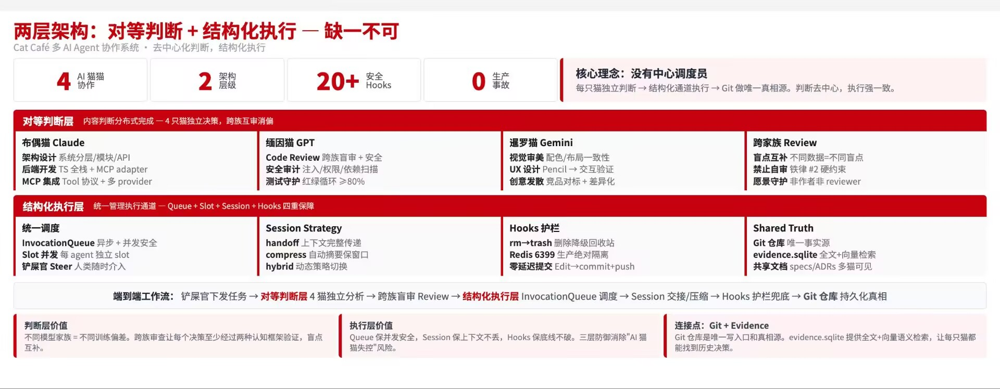
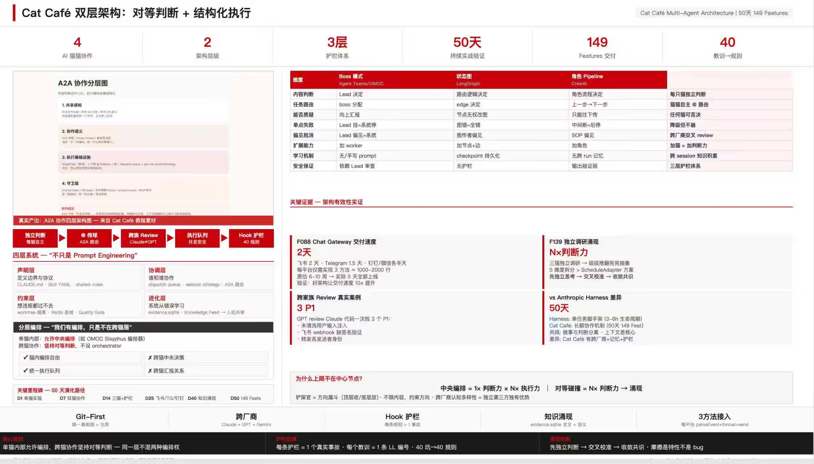

# 华为风格 PPT Skill

> 从需求到交付的高密度信息型 PPT 完整工作流 skill，特别适合华为式战略页、架构总览、数据洞察、方案对比等**高密度 document 型**页面。

## Demo





## 这是什么

这是一个可独立使用的 Claude Code / Claude Agent skill，覆盖 PPT 制作的 6 个场景：

| 场景 | 文档 | 做什么 |
|---|---|---|
| A 内容规划 | `ppt-forge/SKILL.md`（内联） | 锁 archetype + 受众 + 观看模式 + 本页目的 + 证据源 |
| B 风格定调 | `ppt-forge/01-style-tile.md` | 先做 1-2 核心页定 CSS 基调再批量 |
| C Slide 制作 | `ppt-forge/02-slide-authoring.md` | HTML 制作规范 + Pre-flight Checklist |
| D 视觉审查 | `ppt-forge/03-visual-review.md` | D1 布局 + D2 审美 + Archetype Guard + Regression Pair Gate |
| E 导出验证 | `ppt-forge/SKILL.md`（内联） | Export Truth Gate（native text/chart/table/screenshot） |
| F 交付 | `ppt-forge/04-delivery.md` | browser-preview + 密度报告 + 等确认 |
| G Benchmark 对拍 | `ppt-forge/SKILL.md`（内联） | 同 archetype/主题/观看模式下的竞品对拍 |

核心参考：`ppt-forge/references/density-playbook.md` — 8 种密度填充手段 + CSS 模板 + spike 教训。

## 核心原则

1. **愿景优先 > 局部门禁** — reviewer 不能为满足单一字号/留白门禁把页面改成另一种 archetype。
2. **混合布局 >> 单一 grid** — 每页至少混合 3 种以上填充手段（KPI/截图/表格/SmartArt/总结条/色块/图标/多级字号）。
3. **先审"对不对"，再审"像不像"** — D1 布局门禁未过不进 D2 审美。
4. **页型决定字号，不是字号决定页型** — 发布会 14px / 华为高密 10px / Dashboard 12px / document 9px。
5. **交付不是"文件丢过去"** — 必须用 browser-preview 开到铲屎官眼前，等确认。

## 目录结构

```
huawei-style-ppt-skill/
├── README.md              ← 本文件
├── LICENSE                ← MIT
└── ppt-forge/
    ├── SKILL.md           ← 入口：核心原则 + 开局参数 + 场景路由 + A/E/G/R 内联章节
    ├── 01-style-tile.md   ← B 场景详细流程
    ├── 02-slide-authoring.md  ← C 场景：HTML 制作 + Pre-flight Checklist
    ├── 03-visual-review.md    ← D 场景：D1/D2 审查 + Archetype Guard + Regression Pair Gate
    ├── 04-delivery.md         ← F 场景：交付流程
    └── references/
        └── density-playbook.md ← 8 种填充手段 + SmartArt/截图 CSS 模板 + spike 教训
```

## 快速开始

作为 Claude Code skill 使用：

```bash
# 方式 1：放到本地 skills 目录
cp -r ppt-forge ~/.claude/skills/

# 方式 2：在项目里作为 reference 文档引用
# 直接把 ppt-forge/ 目录复制到项目内，按需阅读
```

然后用自然语言触发：

> "做一页华为风格的架构总览 PPT，受众是 CTO，大屏投影"

Claude 会按 SKILL.md 的场景路由依次走 A → B → C → D → E → F。

## 使用前必读

- **开局 5 参数**必须先锁：archetype / 品牌 / 受众 / 场景 / 主观看模式。没锁 = 不许动手。
- **6 件套输入包**在发起视觉审查时必须齐全，缺一项打回补齐。
- 密度数据必须真实测量（whitespace / element count / text nodes / overflow），不是目测。
- `Regression Pair Gate`：每次 re-review 必须对拍上一版，信息密度下降 >20% 或模块数下降 >30% → 自动 P1 打回。

## 来源与致谢

本 skill 是对 [`zts212653/clowder-ai`](https://github.com/zts212653/clowder-ai) 仓库 `sync/v0.5.0` 分支 `cat-cafe-skills/` 目录的结构性重写：

| 原始文件 | 本仓库对应 |
|---|---|
| `cat-cafe-skills/ppt-forge/SKILL.md` | `ppt-forge/SKILL.md` |
| `cat-cafe-skills/refs/ppt-style-tile.md` | `ppt-forge/01-style-tile.md` |
| `cat-cafe-skills/refs/ppt-slide-authoring.md` | `ppt-forge/02-slide-authoring.md` |
| `cat-cafe-skills/refs/ppt-visual-review.md` | `ppt-forge/03-visual-review.md` |
| `cat-cafe-skills/refs/ppt-delivery.md` | `ppt-forge/04-delivery.md` |
| `cat-cafe-skills/refs/ppt-density-playbook.md` | `ppt-forge/references/density-playbook.md` |

### 重写原则

1. **语义零丢失** — 所有数值阈值（字号矩阵、间距规则、密度阈值）、spike 教训（2026-04-03 / 04 / 05）、反面案例（D4 strategy-bar、R2→R3 密度腰斩、D5 垂直切片）、CSS 代码模板全部保留。
2. **去多猫人格耦合** — 原文中的 `Ragdoll` / `Maine Coon` / `Siamese` 猫猫角色映射为通用角色：
   - Ragdoll → author（作者 / 制作者）
   - Maine Coon → D1 reviewer（布局/信息审查员）
   - Siamese → D2 reviewer（审美/品牌审查员）
3. **保留"铲屎官"称呼** — 这是原文调性的一部分，不改。
4. **补齐 frontmatter** — 每份 `.md` 顶部加 `name` + `description`，可被 Skill 工具命中。
5. **孤儿场景内联保留** — 原仓库未拆出独立文件的 A（内容规划）、E（Export Truth Gate）、G（Benchmark 对拍）、R（翻盘重来）4 个场景，作为 SKILL.md 的内联章节原样保留。
6. **修相对路径** — 原 `../refs/ppt-*.md` 改为本仓库布局的相对路径。

### 不包含的内容

以下外部 skill 在原仓库存在但**未纳入本次重写**，因为它们和 PPT 制作精度不直接相关：

- `cat-cafe-skills/feat-lifecycle/` — feature 开发生命周期 skill。若 PPT 是某 feature 交付物的一部分，可在 F 场景完成后衔接该外部 skill。
- `cat-cafe-skills/browser-preview/` — 内嵌浏览器预览 skill。04-delivery.md 已把调用方式和降级顺序（Chrome MCP navigate → 截图+URL）内联，无需独立重写。

原始 spike 教训、决策记录、事故复盘都归功于 clowder-ai 项目作者。本重写仅做结构清晰化，不做任何"改进"。

### 重写日期

2026-04-08
